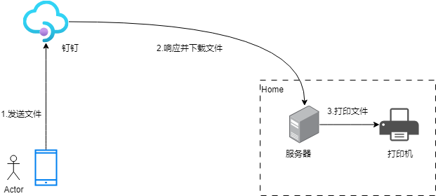
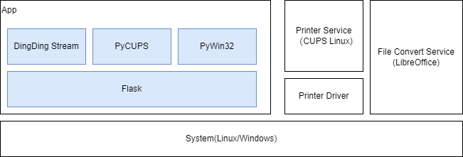

# 钉钉自动打印机器人（dingtalk-printer-bot）

钉钉自动打印机器人:支持文本、图片、文件（Word、Excel、PDF等）自动打印。

---

## 为什么是钉钉打印，不是微信打印？
**微信打印已经有成熟的方案**
1. 新款的打印机很多已经原生支持微信打印
2. **成熟**且**免费**的方案，如：[福昕智慧打印](https://www.foxitcloud.cn/print/)(非软文)

---

## 背景
1. 主要是给娃打印作用用，学校老师用钉钉布置作用。人在公司通过手机远程打印作业。
2. 很久没有写代码了，拿来练练手。

## 使用方式
直接发送文本、图片、文件（Word、Excel、PDF等）给钉钉打印机器人，即可完成打印。
| 附件打印| 图片打印 |文本打印（普通模式）|文本打印（连续模式）|
| --- | --- | --- | --- |
|  |   | | |

## 已有钉钉打印方案

|方案名称|成本|适用场景|说明|
|:---|:---|:---|:---|
|钉钉智能打印云盒|硬件成本（小黄鱼50以内）|钉钉X惠普，适合于惠普部分打印机|兼容性问题，并非所有打印机都支持|
|钉钉智慧云打印|60年/设备|通用|1. 2024年12月1日起，钉钉标准版开始收费 2. 需要一台windows电脑|
|打印盒子|硬件成本（100左右）|适用于部分打印机，具体根据盒子而定|1. 需要安装APP 2. 有些盒子广告比较多。如：小白学习盒子|
|**本项目**|**完全免费**|通用|1.需要一台电脑（win/linux） 2. 一定的动手能力|

## 项目限制
**本项目唯一限制钉钉API免费访问数量**

预计可打印**1500次/月**，如果你的钉钉打印文档数量超过这个数，你可以划走了 :joy:。
> webhook&stream用量：*3000次/月*
> 每次打印消耗2次API请求

## 实现原理
### 1. 数据路径
用户->钉钉->服务器（家里）->打印

### 2. 应用功能图
1. **App**:Python Flask应用
2. **Printer Service**:Linux下使用CUPS，Windows系统自带
3. **File Convert Service**:使用LibreOffice转换文件
注：打印机只能打印pdf、图片、txt，Office文件需要进行文件转换
应用功能图：

# 如何使用
## 钉钉配置
1. 注册钉钉组织（钉钉标准版），具体注册方式可参考：[钉钉企业注册-百度百科](https://jingyan.baidu.com/article/6fb756ec80c40f241858fb1b.html)
2. 添加/配置钉钉机器人，具体可参考：[企业应用开发-钉钉开放平台](https://open.dingtalk.com/document/orgapp/learning-map)

> todo 待补充

## linux环境
### 1. 依赖安装
- 安装&配置CUPS
- 安装LibreOffice

### 2. 安装打印驱动（可选）
取决于CUPS是否支持对应打印机驱动，如果不支持，需要安装打印机驱动。
具体的驱动请在对应打印机官网获取。

## Windows
### 1. 依赖安装
- 安装LibreOffice

### 2. 安装打印驱动
安装打印机驱动

## Docker镜像
待开发……

# RoadMap
- [ ] 支持Windows打印，集成pyWin32
- [x] 增加定时删除文件（uploads、outputs),定时删除7天前的文件
- [x] 增加首页展示展示服务是否正常工作
- [x] 增加钉钉Stream模式（无公网IP，更安全，更便捷）
- [ ] dockerfile编写
