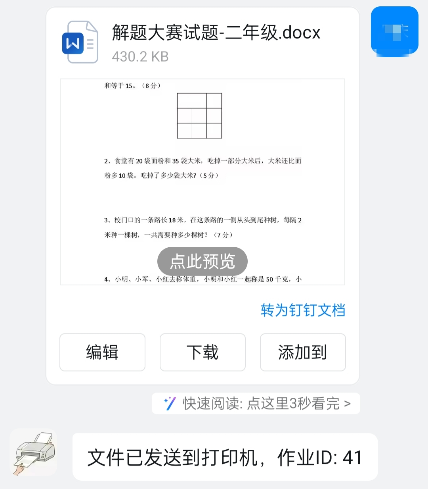
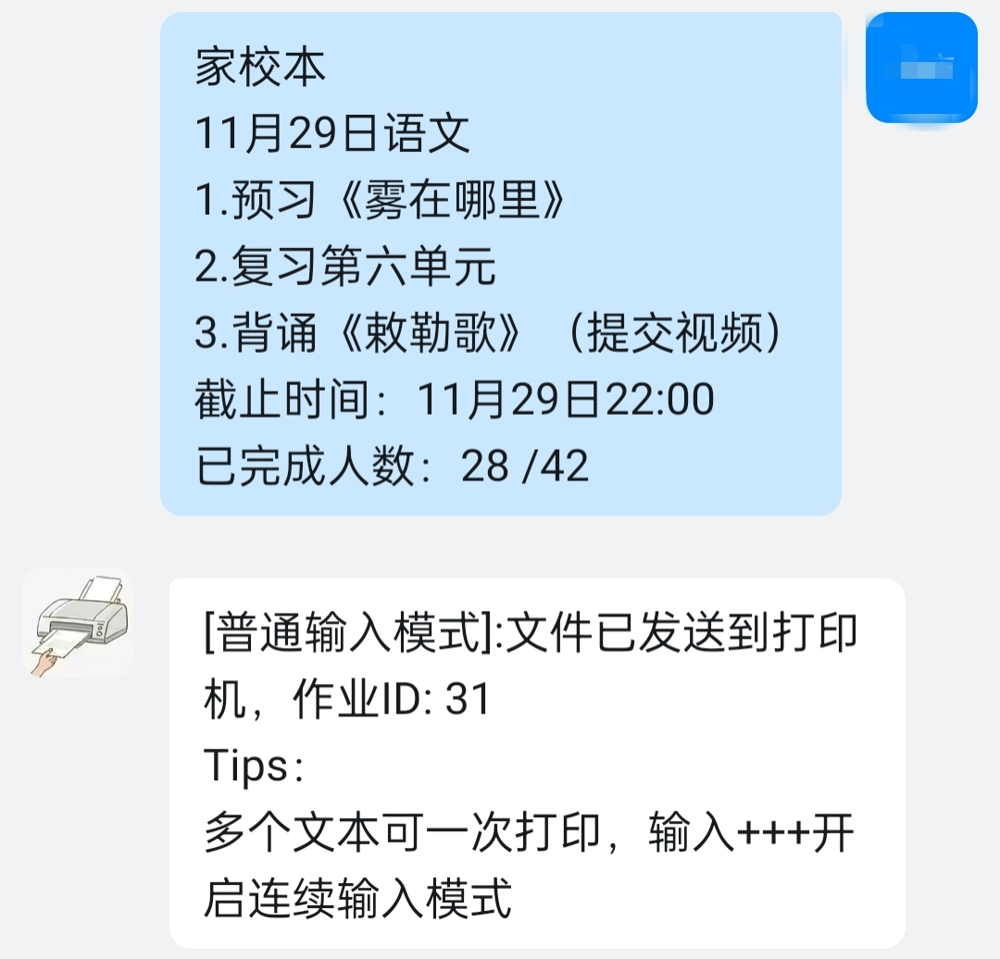
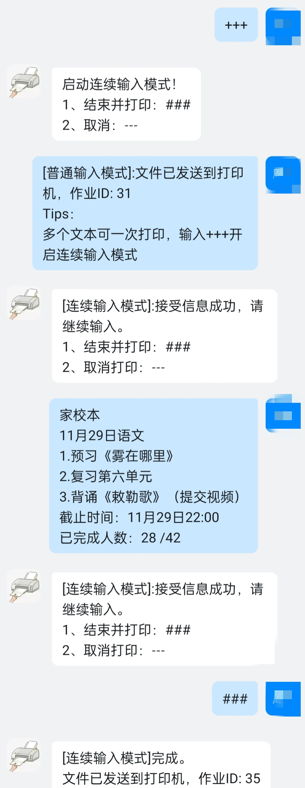
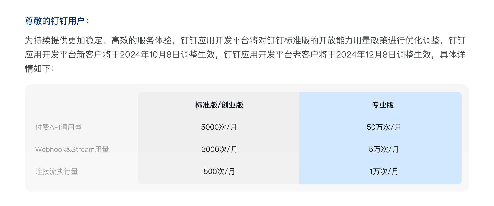

# 钉钉自动打印机器人（dingtalk-printer-bot）
<div align="center">


<p>钉钉自动打印机器人:支持文本、图片、文件（Word、Excel、PDF等）自动打印。</p>
</div>

---

## 为什么是钉钉打印，不是微信打印？
**微信打印已经有成熟的方案**
1. 新款的打印机很多已经原生支持微信打印
2. **成熟**且**免费**的方案，如：[福昕智慧打印](https://www.foxitcloud.cn/print/)(非软文)

---

## 背景
1. 主要是给娃打印作用用，学校老师用钉钉布置作用。人在公司通过手机远程打印作业。
2. 很久没有写代码了，拿来练练手。

## 使用方式
直接发送文本、图片、文件（Word、Excel、PDF等）给钉钉打印机器人，即可完成打印。
| 附件打印| 图片打印 |文本打印（普通模式）|文本打印（连续模式）|
| --- | --- | --- | --- |
|  |   | | |


## 已有钉钉打印方案

|方案名称|成本|适用场景|说明|
|:---|:---|:---|:---|
|钉钉智能打印云盒|硬件成本（小黄鱼50以内）|钉钉X惠普，适合于惠普部分打印机|兼容性问题，并非所有打印机都支持|
|钉钉智慧云打印|60年/设备|通用|1. 2024年12月1日起，钉钉标准版开始收费<br/>2. 需要一台windows电脑|
|打印盒子|硬件成本（100左右）|适用于部分打印机，具体根据盒子而定|1. 需要安装APP<br/>2. 有些盒子广告比较多。如：小白学习盒子|
|**本项目**|**完全免费**|通用|1.需要一台电脑（win/linux）<br/>2. 一定的动手能力|


## 项目限制
**本项目唯一限制钉钉API免费访问数量**


预计可打印**1500次/月**，如果你的钉钉打印文档数量超过这个数，你可以划走了 :joy:。
> webhook&stream用量：*3000次/月*
> 每次打印消耗2次API请求

## 实现原理
### 1. 数据路径
用户->钉钉->服务器（家里）->打印


### 2. 应用功能图
1. **App**:Python Flask应用
2. **Printer Service**:Linux下使用CUPS，Windows系统自带
3. **File Convert Service**:使用LibreOffice转换文件
注：打印机只能打印pdf、图片、txt，Office文件需要进行文件转换
应用功能图：


# 如何使用
## 钉钉配置
1. 注册钉钉组织（钉钉标准版），具体注册方式可参考：[钉钉企业注册-百度百科](https://jingyan.baidu.com/article/6fb756ec80c40f241858fb1b.html)
2. 添加/配置钉钉机器人，具体可参考：[企业应用开发-钉钉开放平台](https://open.dingtalk.com/document/orgapp/learning-map)

如何配置机器人参考：[钉钉机器人配置.md](./ding-bot.md)

## 配置文件
```
class Config:
    # 打印机设置
    PRINTER ={
        "name":"<your printer>",
        "options":{
            'media': 'A4',
            'color-mode': 'color',
            }
    }
    CUPS = {
        "host": "localhost",
        "port": 631,
    }
    DING_TALK = {
        'Mode':'stream', # stream/http
        'AgentId':'<your agentid>',
        'AppKey':'<your appkey>',
        'AppSecret':'<your appsecret>',
        'AccessTokenURL':'https://api.dingtalk.com/v1.0/oauth2/accessToken',
        'DownloaFiledURL':'https://api.dingtalk.com/v1.0/robot/messageFiles/download',
        "SendMessageURL":'https://api.dingtalk.com/v1.0/robot/oToMessages/batchSend'
    }
    FONT = {
        "font_name":"SimSun", # 默认字体：宋体
        "font_path":"SIMSUN.TTC", # 路径：app/fonts，可自行添加对应的字体
        "font_size":16 # 默认字体14
    }
```
|类型| 参数 | 描述 |
|:---|:---|:---|
|your printer|打印机名称|可在cups查看|
|your agentid|钉钉应用agentid|可在钉钉应用查看|
|your appkey|钉钉应用appkey|可在钉钉应用查看|
|your appsecret|钉钉应用appsecret|可在钉钉应用查看|

## linux环境
### 1. 依赖安装
- 安装&配置CUPS
- 安装LibreOffice

### 2. 安装打印驱动（可选）
取决于CUPS是否支持对应打印机驱动，如果不支持，需要安装打印机驱动。
具体的驱动请在对应打印机官网获取。


## Windows
### 1. 依赖安装
- 安装LibreOffice

### 2. 安装打印驱动
安装打印机驱动

## Docker镜像
> 基于docker-hub:[@ydkn/cups](https://hub.docker.com/r/ydkn/cups)，增加支持python应用程序支持


推荐使用docker-compose
```
version: '3.8'  
services:
  web:
    image: zqing90/printer-bot:last
    container_name: dingtalk-printer-bot  # 容器名称
    ports:
      - 5000:5000 #应用端口
      - 631:631 # cups服务端口
    restart: always
    volumes:
      - ./config.py:/usr/src/app/app/config.py  # 覆盖配置文件
      - ./cups:/etc/cups # cups配置文件
      - ./uploads:/usr/src/app/app/uploads # 上传文件
      - ./outputs:/usr/src/app/app/outputs # 输出文件
    devices:
      - /dev/bus/usb:/dev/bus/usb # 挂载USB 
```
|类型| 参数 | 描述 |
|:---|:---|:---|
|port|5000|应用端口|
|port|631|cups服务端口|
|volume|config.py|配置文件，路径:[/app/config.py](/app/config.py)|
|volume|cups|cups配置文件|
|volume|uploads|上传文件夹，可选|
|volume|outputs|输出文件夹，可选|
|device|/dev/bus/usb|挂载整个USB|

**问题：打印机自动关机后启动，无法打印，需要重启容器**
**解决方案：利用udev检测打印机设备状态，自动重启容器**
```
# Step1：查看自己的打印机设备信息
root@pve:/etc/udev/rules.d# lsusb
Bus 003 Device 016: ID 04a9:1794 Canon, Inc. G3000 series

# Step2：创建udev规则文件
root@pve:/etc/udev/rules.d# vim 99-printer.rules
# 内容如下：自行替换打印机设备信息和容器名称
# 04a9，1794为打印机设备信息
# dingtalk-printer-bot 为容器名称
ACTION=="add", SUBSYSTEM=="usb", ENV{DEVTYPE}=="usb_device", ENV{ID_VENDOR_ID}=="04a9", ENV{ID_MODEL_ID}=="1794", RUN+="/usr/bin/docker restart dingtalk-printer-bot"

# Step3：重载udev规则
root@pve:/etc/udev/rules.d# udevadm control --reload-rules
root@pve:/etc/udev/rules.d# udevadm trigger
```

# RoadMap
- [ ] 支持Windows打印，集成pyWin32
- [x] 增加定时删除文件（uploads、outputs),定时删除7天前的文件
- [x] 增加首页信息展示
- [x] 增加钉钉Stream模式（无公网IP，更安全，更便捷）
- [x] 支持Docker部署Docker打包
